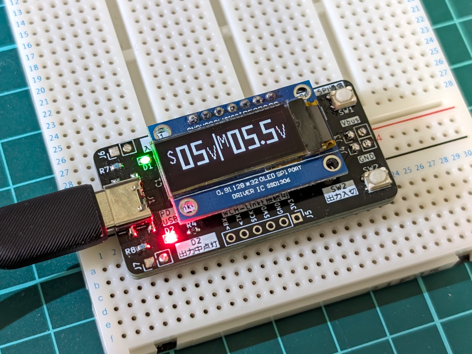
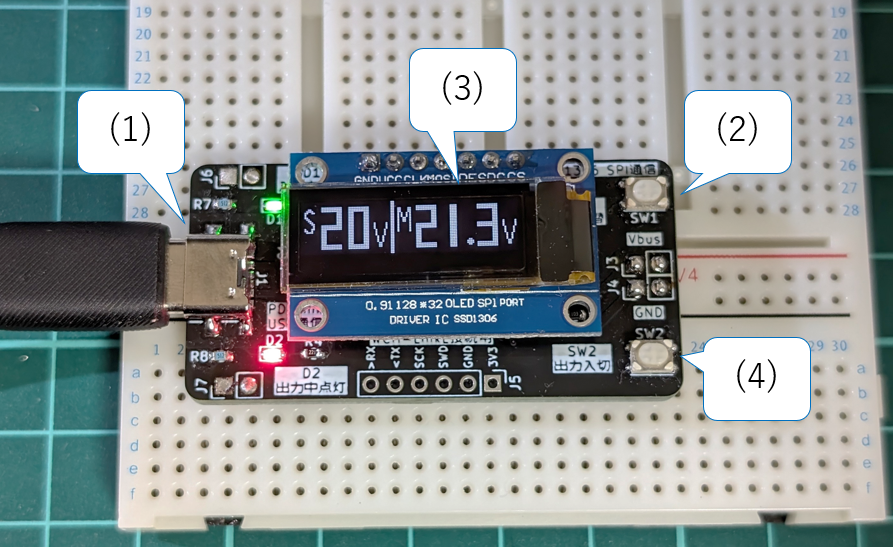
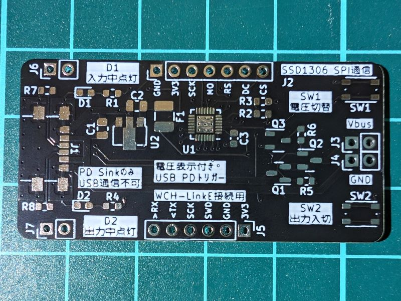

# 電圧表示付き USB PD トリガー
 WCH CH32X035 マイコンを使用して、Vbus電圧をSSD1306 OLEDモジュールに表示する、USB PDトリガーデバイスです。  
 

# 紹介動画

# 操作手順
1. USB-CコネクタにUSB PD電源を接続します。
1. 電圧切替スイッチで出力電圧を変更します。(5→9→12→15→20Vのループ)
1. OLEDディスプレイで希望の電圧が出ていることを確認します。
1. 出力入切スイッチを押すと基板右端のヘッダピンから出力されます。  

# 注意
- 出力電圧はUSB電源(USB PD Source)の仕様に依存します。設定電圧とVbus電圧が乖離する場合があります。
- 表示されるVbus電圧は目安で、測定器としての精度を保証するものではありません。
- 出力電流は1A程度を想定して設計しています。
- このデバイスの使用における損害は一切保証いたしません。自己責任でご使用ください。

# 販売
[boothにて販売中](https://suzan-works.booth.pm/items/5385432)

# マイコン開発
Arduino IDEでのファームウェア変更が可能です。  
WCH LinkEエミュレーターでPCに接続して、「ボードマネージャ」＞「CH32V EVT Boards Support」＞「CH32X035」を選択します。  
参考情報  
https://github.com/openwch/arduino_core_ch32  
https://youtu.be/PSXAfMaWH_A?si=gFLTGL1ydqfZDPP8  

# 設計資料 v1.0
## 回路図
- 回路図 [PDF](回路図.pdf) [KiCanvas](https://kicanvas.org/?github=https%3A%2F%2Fgithub.com%2Fsuzan-works%2FUSBPDTrigger-VoltDisplay%2Fblob%2Fmain%2FKiCad%2FCH32X035_USBPD-Trigger_4.kicad_sch)  
- BOM

|Reference|Value|ECサイト|コメント|
|:----|:----|:----|:----|
|U1|マイコン CH32X035G8U6| | |
|U2|三端子レギュレータ NJM78L33SU3|https://akizukidenshi.com/catalog/g/gI-11319/| |
|J1|USB Type-Cコネクタ 電源供給用|https://akizukidenshi.com/catalog/g/gC-16438/|コネクタの固定用ピンをカットして実装しています|
|J2|OLEDディスプレイ SSD1306 SPI 128x32 0.91インチ| | |
|J3, J4, J6, J7|ピンヘッダ 2.54mmピッチ|https://akizukidenshi.com/catalog/g/gC-00167/| |
|J5|WCH-LinkE| | |
|C1, C2|1u/50V/2012|https://akizukidenshi.com/catalog/g/gP-15331/| |
|C3|1u/25V/1608|https://akizukidenshi.com/catalog/g/gP-14526/| |
|R1, R4|220/1608/±5%| | |
|R2|10k/1608/±1%|https://www.marutsu.co.jp/pc/i/857775/| |
|R3|1k/1608/±1%|https://www.marutsu.co.jp/pc/i/857774/| |
|R5|10k/1608/±5%| | |
|R6|22k/1608/±5%| | |
|R7, R8|5.1k/1608/±5%| | |
|D1|緑チップLED SML-E12P8WT86|https://akizukidenshi.com/catalog/g/gI-11878/| |
|D2|赤チップLED SML-E12V8WT86|https://akizukidenshi.com/catalog/g/gI-11879/| |
|F1|ポリスイッチ microSMD010|https://akizukidenshi.com/catalog/g/gP-01316/| |
|Q1, Q2|Pch MOSFET AO3401A|https://akizukidenshi.com/catalog/g/gI-14654/| |
|Q3|抵抗入りトランジスタ DTC143ZU3HZGT106|https://akizukidenshi.com/catalog/g/gI-16746/|基板フットプリントが間違っており無理やり実装しています|
|SW1, SW2|タクトスイッチ SKRPABE010|https://akizukidenshi.com/catalog/g/gP-06184/| |

## プリント基板
- 基板CAD [KiCanvas](https://kicanvas.org/?github=https%3A%2F%2Fgithub.com%2Fsuzan-works%2FUSBPDTrigger-VoltDisplay%2Fblob%2Fmain%2FKiCad%2FCH32X035_USBPD-Trigger_5.kicad_pcb)
- 外観写真  

## ファームウェア
- ファームウェア [inoファイル](USBPDTrigger-VoltDisplay.ino)
